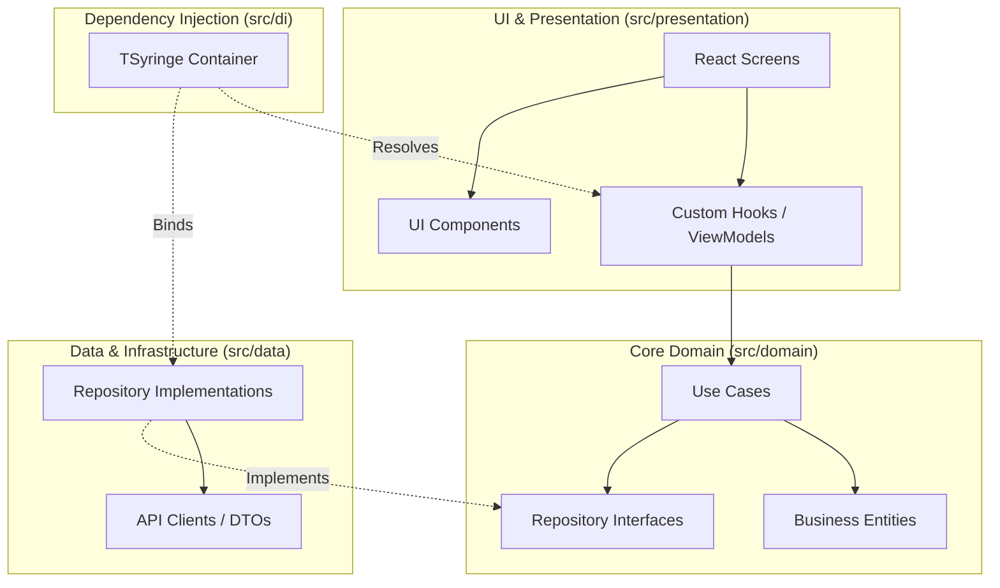

<div align="center">
  

  # Mi Recuerdo Vivo (Mobile)

  **Transforming voice messages into structured memory diaries for elderly users.**

  [](https://reactnative.dev/)
  [](https://expo.dev/)
  [](https://www.typescriptlang.org/)
  [](https://jestjs.io/)
</div>

---

## 📖 Overview

**Mi Recuerdo Vivo** is a specialized mobile application designed with accessibility in mind for elderly adults. It acts as an intelligent, voice-first diary. Users simply speak their memories, and the ecosystem's AI engine transcribes, structures, and categorizes these voice memos into a rich, navigable memory journal, while periodically generating wellness summaries.

This repository contains the **React Native / Expo** mobile application that interfaces with the [`living-memories-api`](../living-memories-api) backend.

*(Screenshot Placeholders: Insert UI mockups/screenshots here)*

---

## 🛠️ Tech Stack

- **Framework**: React Native 0.85 & Expo SDK ~56
- **Language**: TypeScript
- **UI & Styling**: React Native Paper (Material Design 3) & Expo Vector Icons
- **Navigation**: React Navigation (Native Stack)
- **Dependency Injection**: `tsyringe` + `reflect-metadata`
- **Testing**: Jest + React Native Testing Library

---

## 🏛️ Architecture

This project strictly adheres to **Clean Architecture** principles to ensure separation of concerns, testability, and independence from UI frameworks and external services.



### 📂 Directory Structure

```text
src/
├── app/               # App entry points, global contexts, and providers
├── di/                # Dependency Injection setup and registry
├── domain/            # Pure business logic (Entities, Use Cases, Interfaces)
├── data/              # API Clients, Repositories, DTO mappings
└── presentation/      # Screens, ViewModels (Hooks), and reusable Components
    ├── components/    # Dumb UI components (React Native Paper extensions)
    ├── hooks/         # Stateful logic acting as ViewModels
    ├── screens/       # Full-screen route components
    └── theme/         # App-wide color tokens and typography
```

---

## 🤖 AI Agent Ecosystem (4D Framework)

This repository is developed using an advanced AI-augmented workflow based on the **Human-on-the-Loop** model. The codebase rules and standards are enforced by a team of specialized AI agents.

| Agent | Role | Capabilities |
|-------|------|--------------|
| 📐 `lm_architect` | **Technical Architect** | Reads code, defines feature slice, writes `implementation_plan.md`. Never writes code. |
| 💻 `lm_developer` | **Implementer** | Reads the plan and writes production TypeScript code adhering to Clean Architecture. |
| 🧪 `lm_qa` | **QA Engineer** | Writes and executes Jest/RNTL tests based on the developer's output. |
| 🌿 `lm_git` | **Git Operator** | Archives plans, creates branches, formats conventional commits, and opens PRs. |
| 📝 `lm_writer` | **Technical Writer** | *(Optional)* Syncs session context and decisions into the developer's Spanish Obsidian Vault. |

**Developer Workflow:**
1. Describe the User Story to the Orchestrator.
2. `lm_architect` proposes an `implementation_plan.md`.
3. **[Human Approval]**
4. `lm_developer` implements code $\rightarrow$ `lm_qa` adds tests $\rightarrow$ `lm_git` commits.

---

## 🚀 Getting Started

### Prerequisites

- Node.js (v18+)
- npm or yarn
- Expo CLI (`npm install -g expo-cli`)
- iOS Simulator or Android Emulator (or Expo Go on a physical device)

### Installation

1. **Clone the repository:**
   ```bash
   git clone <repo-url>
   cd living-memories-mobile
   ```

2. **Install dependencies:**
   ```bash
   npm install
   ```

3. **Environment Setup:**
   Create a `.env` file in the root based on `.env.example` (if applicable) and configure the backend API URL.

4. **Start the development server:**
   ```bash
   npx expo start
   ```

---

## 🧪 Testing

We use Jest and React Native Testing Library for our test suites.

- **Run all tests:**
  ```bash
  npm test
  ```
- **Update snapshots:**
  ```bash
  npm test -- -u
  ```

---

## 📜 License

This project is licensed under the **0BSD License**. See the `package.json` for details.
